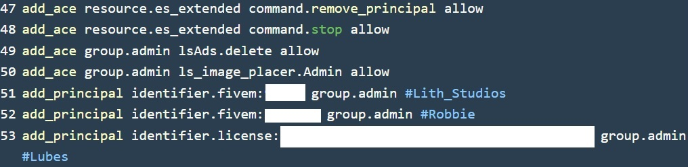

## IMPORTANT SETUP STEP
* Head over to your `server.cfg` file
* Add this line in your `server.cfg` file\
`add_ace group.admin ls_image_placer.Admin allow` 
* Your `server.cfg` file should look like this

## INSTRUCTIONS FOR USING DEV MODE
* Use command 'devmode' and a red marker will appear when you are facing a wall.
* Press E to select points of the image
* The first point of the image has to be top left corner, the second point has to be in bottom right corner!
* After second point is selected, input image link or image path and press submit
* **NOTE**: To use image path, the image has to be uploaded to ls_image_placer/images folder. Only type image's name and extension. E.G. bingo.png
* Adjust image's offset by using the slider and confirm! :)

